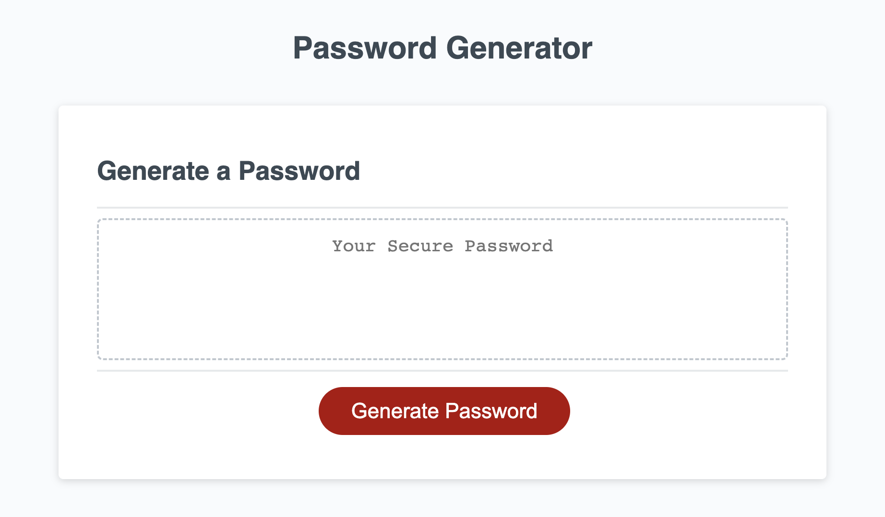

# Module 03 - JavaScript Challenge: Password Generator

## Description

Use JavaScript to generate a random password based on user-specified criteria.

## Installation

N/A

## Usage

Access the website at https://aerostokes.github.io/passsword-generator_challenge-03/

Click "Generate Password" and answer the prompts for desired password length and whether to include lower case letter, upper case letters, numbers, and/or special characters.

## Credits

N/A

## License

See repo.
